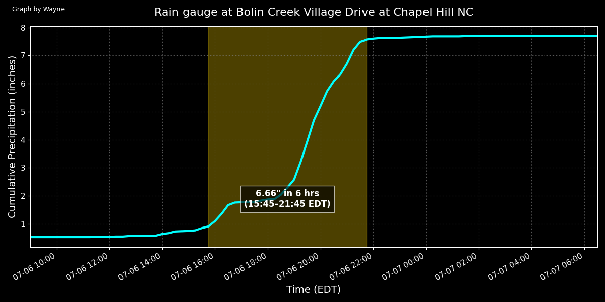
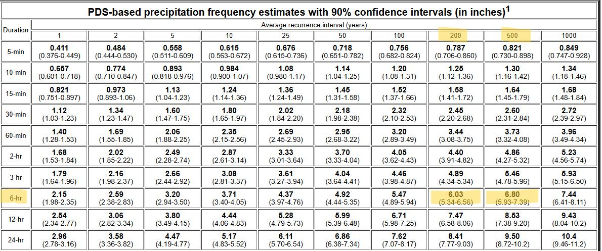
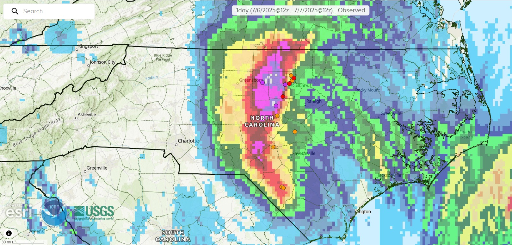

# chantal-rainfall-analysis
Python-based rainfall analysis and visualization of Tropical Storm Chantal using USGS precipitation observations

# Tropical Storm Chantal Rainfall Analysis

## Event Overview

Tropical Storm Chantal was the first tropical system of the 2025 Atlantic hurricane season to significantly impact North Carolina, producing widespread flooding rainfall across portions of the Piedmont and Sandhills.

Although Chantal was not an especially strong or long-lived tropical cyclone, its slow movement and deep Atlantic moisture led to significant hydrologic impacts after landfall in South Carolina on July 6, 2025. The heaviest rainfall occurred near and just west of the remnant low-pressure track across central North Carolina.

Multiple observing stations across Orange, Chatham, Moore, and Alamance counties recorded more than 7 inches of rainfall, with localized totals exceeding 10 inches. Several rivers reached major flood stage, including portions of the Haw River and Eno River basins, with some gauges approaching or exceeding historical flood crests associated with Hurricane Fran (1996).

## Project Overview

This project analyzes high-frequency precipitation observations collected near Chapel Hill, NC during Tropical Storm Chantal. Using Python, Pandas, Excel, and Matplotlib, I analyzed rainfall intensity, cumulative precipitation, and rolling 6-hour rainfall totals to identify the most extreme short-duration rainfall period associated with the storm.

## Objective

The goal of this project was to determine when the most intense sustained rainfall occurred during Tropical Storm Chantal, visualize how rainfall evolved through time using observational rain gauge data, and compare the event against NOAA Atlas 14 rainfall frequency guidance to assess the rarity and significance of the event.

## Data Sources

 USGS high-frequency rain gauge observations
 NOAA Atlas 14 rainfall frequency guidance
 Iowa State Mesonet 

## Methodology

 Processed 15-minute precipitation observations using Excel and Python
 Calculated cumulative rainfall totals to visualize storm evolution
 Converted rainfall observations into hourly-equivalent rainfall rates
 Performed rolling 6-hour accumulation analysis to identify the peak short-duration rainfall window
 Created a rainfall visualization using Matplotlib

## Key Findings

 Over 7 inches of rainfall fell during Tropical Storm Chantal
 A peak 6-hour rainfall accumulation of 6.66 inches occurred between 4 PM and 10 PM EDT
 Peak rainfall rates exceeded 3 inches per hour during the event's most intense tropical rainbands
 NOAA Atlas 14 estimates suggested the event approached a 200–500-year rainfall recurrence interval

# Final Visualizations

## Python Rainfall Analysis Visualization

## NOAA Atlas 14 Rainfall Frequency Reference

## Event Rainfall Totals Reference

## Event Rainfall Totals Reference

